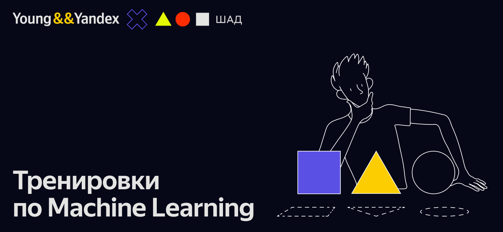

# academy_yandex_Algorithm-Training

⌨️ Solutions to Academy Yandex "Тренировки по Machine Learning"

## About the training
ML — это новое направление Тренировок, которое создано совместно с Школой анализа данных. Первые Тренировки по ML посвящены классическому машинному обучению.

### Instructors
[Радослав Нейчев](https://harbour.space/faculty/radoslav-neychev)
> [!NOTE]
> Выпускник и преподаватель ШАД, старший разработчик лаборатории машинного интеллекта Яндекса, сооснователь girafe-ai, автор курсов по машинному обучению и лектор в МФТИ, MADE и МГУ; академический директор AI track в Harbour.Space University (Испания и Таиланд), соавтор учебника по машинному обучению от Яндекса.

### Offered by
[Академия Яндекса](https://academy.yandex.ru/) и [ШАД](https://shad.yandex.ru/)

> [!IMPORTANT]
> В этом репозитории я буду хранить исключительно ЭмЭль, возможно вы ищите:
> - [Тренировки по Алгоритмам](https://github.com/MisterZurg/academy_yandex_Algorithm-Training)
> - [Тренировки по DevOps](https://github.com/MisterZurg/academy_yandex_DevOps-Training)

> [!NOTE]
> [Github Тренировки по Machine Learning](https://github.com/girafe-ai/ml-course/tree/23f_yandex_ml_trainings)

> [!WARNING]
> Тут будет появлятся контент по мере моего интереса, тк
> понимаете я собствено Machine Cringe Learning и если будет возможность сдавать
> всё на Go, тут будет Python free zone.
 
## Syllabus
### Тренировки по ML 1.0
> Классическое машинное обучение
- [Лекция 1: Вводная по ML + knn](https://www.youtube.com/watch?v=k3UJOG-DKHE&ab_channel=Young%26%26Yandex)
- [Лекция 2: Линейная регрессия и регуляризация](https://www.youtube.com/watch?v=5qLVUO0q644&ab_channel=Young%26%26Yandex)
- Линейная классификация, метод максимального правдоподобия
- Решающие деревья, композиции деревьев, Random Forest
- Градиентный бустинг, тонкости обучения
- Оценка значимости признаков, обучение без учителя
- Обзорная лекция по DL

### Тренировки по ML 2.0
> Natural Language Processing
- Информативные векторные представления в машинном обучении
- Обработка последовательностей: генеративные и дискриминативные модели
- Механиз внимание, или почему скалярное произведение круче всех. Outro про машинный перевод
- Машинный перевод
- Большие языковые модели и где они обитают
- Большие языковые модели
- Рекомендательные системы
- Ранжирование, информационный поиск и другие смежные с NLP задачи
- Введение в обработку звука: голосовая активация, биометрия, распознавание речи
- VLM
- Мультимодальные и мультиагентные системы. Куда современные модели будут двигаться дальше?
